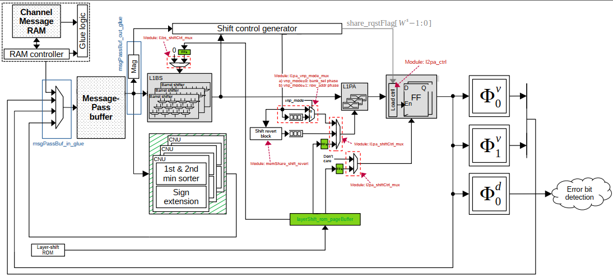

### Project Overview

This project provides the design and impelemtation of message-pass routing network for QC-LDPC decoding, where the underlying decoder architecture is assumed to be a **partially-parallel** configuration that only a fraction of check node and variable node processes mapped from each submatrix are handled concurrently. The figure below illustrates the block diagram of the proposed decoder architecture where the message-pass routing network consists of three primary building blocks with grey colour.

---

### Development Plan

- RTL impelmentation
  - [x] Build the RTL modules: L1BS, L1PA and L2PA
- UVM testbench for verification of the overall routing network
  - [ ] Build an abstruct simulator using Python 
  - [ ] Build UVM environment using SystemVerilog
  - [ ] Build UVM environment using cocotb+pyuvm
  - [ ] Error free from SystemVerilog-based UVM env.
  - [ ] Error free from Python-based UVM env.
- Formal verification for verification of the overall routing network
  - [ ] Build FV using SymbiYosys (sby)
  - [ ] Error free from the sby-based FV env.
- ASIC synthesis
  - [ ] Build Yosys synthesis env.
  - [ ] Build Design Compiler env.
- FPGA emulation
  - [ ] Build an FPGA synthesis env.
  - [ ] PL <--> PC communication via PYNQ
- Automatic RTL generator
  - [ ] Arrange the existing Python-base RTL generator
  - [ ] Write a script to automatically launch the regression test using the both UVM testbench and FV env.
  - [ ] Write a script to automate the ASIC synthesis process
- Documentation about how to use this RTL generator
  - [ ] Design specification including the I/F table and block diagram 
  - [ ] Markdown version
  - [ ] LaTex version
 
---

| Type  | Name | Description | Design Rule | Declaration/Definition |
| :---   | :--- | :--- | :--- | :--- |
| 1 |  |  |  | |
| 2 |  |  | 
